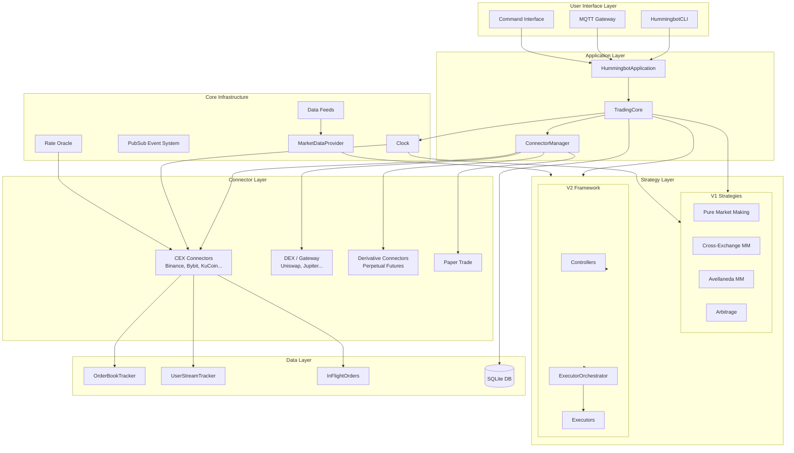

# Hummingbot Documentation

**Version**: 2.10.0
**License**: Apache-2.0
**Language**: Python 3.12, Cython
**Branch**: `feature/ayu_develop`

## Overview

Hummingbot is an open-source crypto trading bot that enables cross-exchange market making, arbitrage, and automated trading strategies. It supports 28+ centralized exchanges (CEX) and 15+ decentralized exchanges (DEX) through a unified connector architecture, with both a CLI interface and headless operation mode.

The system is built on an event-driven architecture with a Cython-optimized core for low-latency order processing. It provides two strategy frameworks: a legacy V1 system (Cython-based strategies like Pure Market Making and Cross-Exchange Market Making) and a modern V2 system with controllers, executors, and a modular execution pipeline.

## Key Features

- **Cross-Exchange Market Making (XEMM)**: Place maker orders on one exchange and hedge with taker orders on another
- **Pure Market Making (PMM)**: Automated bid/ask quoting with configurable spreads, inventory skew, and hanging orders
- **Avellaneda Market Making**: Academic model-based market making with optimal spread calculation
- **Arbitrage**: Cross-exchange and AMM arbitrage strategies
- **Strategy V2 Framework**: Modern controller/executor architecture with position management, DCA, grid, TWAP, and XEMM executors
- **28+ CEX Connectors**: Binance, Bybit, KuCoin, OKX, Gate.io, Coinbase, Kraken, and more
- **15+ Derivative Connectors**: Perpetual futures on Binance, Bybit, OKX, Hyperliquid, dYdX v4, etc.
- **Gateway Integration**: DEX trading via Gateway middleware (Ethereum, Solana chains)
- **Rate Oracle**: Cross-exchange price feeds from 15+ sources for accurate conversion rates
- **MQTT Bridge**: Remote monitoring and control via MQTT protocol
- **Paper Trading**: Simulated trading for strategy testing without real funds
- **Kill Switch**: Automatic strategy shutdown based on PnL thresholds

## Official Links

| Resource | URL |
|----------|-----|
| Website | [hummingbot.org](https://hummingbot.org) |
| GitHub | [github.com/hummingbot/hummingbot](https://github.com/hummingbot/hummingbot) |
| Documentation | [docs.hummingbot.org](https://docs.hummingbot.org) |
| Discord | [discord.gg/hummingbot](https://discord.gg/hummingbot) |

## Architecture Overview



## Component Summary

| Component | Location | Description |
|-----------|----------|-------------|
| HummingbotApplication | `src/hummingbot/client/hummingbot_application.py` | Main application singleton, CLI integration |
| TradingCore | `src/hummingbot/core/trading_core.py` | Core trading engine: clock, connectors, strategies |
| ConnectorManager | `src/hummingbot/core/connector_manager.py` | Dynamic connector creation and lifecycle |
| Clock | `src/hummingbot/core/clock.pyx` | Cython clock with REALTIME and BACKTEST modes |
| ConnectorBase | `src/hummingbot/connector/connector_base.pyx` | Base class for all exchange connectors |
| ExchangeBase | `src/hummingbot/connector/exchange_base.pyx` | CEX connector base with order books |
| ExchangePyBase | `src/hummingbot/connector/exchange_py_base.py` | Python base for modern exchange connectors |
| StrategyBase | `src/hummingbot/strategy/strategy_base.pyx` | V1 Cython strategy base with event listeners |
| StrategyV2Base | `src/hummingbot/strategy/strategy_v2_base.py` | V2 strategy base with controller/executor support |
| ControllerBase | `src/hummingbot/strategy_v2/controllers/controller_base.py` | V2 controller base for signal generation |
| ExecutorBase | `src/hummingbot/strategy_v2/executors/executor_base.py` | V2 executor base for order execution |
| ExecutorOrchestrator | `src/hummingbot/strategy_v2/executors/executor_orchestrator.py` | Manages executor lifecycle and position tracking |
| PubSub | `src/hummingbot/core/pubsub.pyx` | Cython pub/sub with weak references |
| RateOracle | `src/hummingbot/core/rate_oracle/rate_oracle.py` | Cross-exchange price conversion rates |
| MarketDataProvider | `src/hummingbot/data_feed/market_data_provider.py` | Candles, rates, and market data for V2 strategies |
| GatewayHttpClient | `src/hummingbot/core/gateway/gateway_http_client.py` | DEX gateway REST client |
| InFlightOrder | `src/hummingbot/core/data_type/in_flight_order.py` | Order state machine and tracking |
| OrderBookTracker | `src/hummingbot/core/data_type/order_book_tracker.py` | Real-time order book management |

## Quick Start

A minimal Pure Market Making (PMM) configuration that places bid/ask orders around the mid price on the paper trade exchange. No API keys required.

**Step 1**: Create a strategy config file at `conf/strategies/pmm_quickstart.yml`:

```yaml
strategy: pure_market_making
exchange: binance_paper_trade
market: BTC-USDT
bid_spread: 0.5           # 0.5% below mid price
ask_spread: 0.5           # 0.5% above mid price
order_amount: 0.001       # 0.001 BTC per order
order_refresh_time: 30    # Refresh orders every 30 seconds
order_levels: 1           # Single level on each side
inventory_skew_enabled: false
hanging_orders_enabled: false
order_optimization_enabled: false
add_transaction_costs: false
price_source: current_market
price_type: mid_price
```

**Step 2**: Start Hummingbot and load the strategy:

```bash
# Install and build Cython extensions
pip install -e ".[all]"
python setup.py build_ext --inplace

# Start the interactive CLI
python -m hummingbot
```

Inside the Hummingbot CLI:
```
>>> connect binance_paper_trade
>>> import pmm_quickstart
>>> start
```

The bot will begin placing bid/ask orders on the paper trade simulator with 10,000 USDT and 1 BTC default balances.

**For V2 strategies** (recommended for new development), create a script in `scripts/`:

```python
# scripts/simple_pmm.py
from decimal import Decimal
from typing import List
from hummingbot.strategy.strategy_v2_base import StrategyV2Base
from hummingbot.strategy_v2.models.executor_actions import (
    CreateExecutorAction, ExecutorAction,
)
from hummingbot.strategy_v2.executors.position_executor.data_types import (
    PositionExecutorConfig, TripleBarrierConfig,
)
from hummingbot.core.data_type.common import TradeType

class SimplePMM(StrategyV2Base):
    def create_actions_proposal(self) -> List[ExecutorAction]:
        mid = self.get_mid_price("binance_paper_trade", "BTC-USDT")
        if mid is None:
            return []
        spread = Decimal("0.005")
        cfg = lambda side, price: PositionExecutorConfig(
            connector_name="binance_paper_trade",
            trading_pair="BTC-USDT",
            side=side,
            amount=Decimal("0.001"),
            entry_price=price,
            triple_barrier_config=TripleBarrierConfig(
                take_profit=Decimal("0.01"),
                stop_loss=Decimal("0.005"),
                time_limit=300,
            ),
        )
        return [
            CreateExecutorAction(executor_config=cfg(TradeType.BUY, mid * (1 - spread))),
            CreateExecutorAction(executor_config=cfg(TradeType.SELL, mid * (1 + spread))),
        ]
```

## Gateway / DEX Setup Overview

Hummingbot Gateway is a separate middleware service that enables trading on decentralized exchanges (DEXs). It handles wallet management, transaction signing, and chain-specific RPC communication.

### Architecture

```
Hummingbot CLI/Bot <--REST--> Gateway (Node.js) <--RPC--> Blockchain Nodes
                                  |
                            Wallet Manager
                            (encrypted keystores)
```

### Supported Chains and DEXs

| Chain | DEXs | Connector Type |
|-------|------|---------------|
| Ethereum | Uniswap V2/V3, SushiSwap, Curve | AMM Swap |
| Arbitrum | Uniswap V3, SushiSwap | AMM Swap |
| Polygon | QuickSwap, Uniswap V3 | AMM Swap |
| Avalanche | Pangolin, TraderJoe | AMM Swap |
| BNB Chain | PancakeSwap | AMM Swap |
| Solana | Jupiter, Raydium | AMM Swap |
| Harmony | DeFi Kingdoms | AMM Swap |

### Setup Steps

1. **Install Gateway**: Clone the [hummingbot/gateway](https://github.com/hummingbot/gateway) repository and follow its README
2. **Configure in Hummingbot**: The client config at `conf/conf_client.yml` controls the Gateway connection:
   - `gateway_api_host`: Gateway hostname (default: `localhost`)
   - `gateway_api_port`: Gateway port (default: `15888`)
   - `gateway_use_ssl`: Enable SSL (default: `true`)
3. **Connect a wallet**: Use the `gateway connect` command in the Hummingbot CLI to import or create a wallet for your target chain
4. **Generate certificates**: Gateway uses mTLS. Hummingbot generates client certificates on first `gateway connect`

### Gateway Configuration in Hummingbot

| Parameter | Type | Default | Description |
|-----------|------|---------|-------------|
| `gateway_api_host` | `str` | `"localhost"` | Gateway REST API hostname |
| `gateway_api_port` | `str` | `"15888"` | Gateway REST API port |
| `gateway_use_ssl` | `bool` | `true` | Whether to use SSL/TLS for Gateway communication |

## Documentation Index

| Document | Description |
|----------|-------------|
| [Architecture](architecture.md) | System architecture, connector hierarchy, strategy class diagrams |
| [Workflows](workflow.md) | Order lifecycle, market making flows, event system |
| [State Management](state-management.md) | Order states, market tracking, position management |
| [Development](development.md) | Setup, project structure, creating strategies and connectors |
| [Migration Guide](MIGRATION_GUIDE.md) | Python tooling modernization notes |
