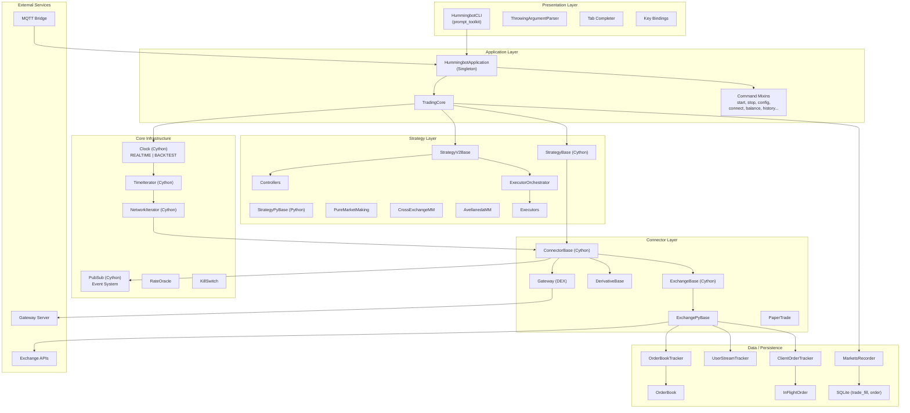
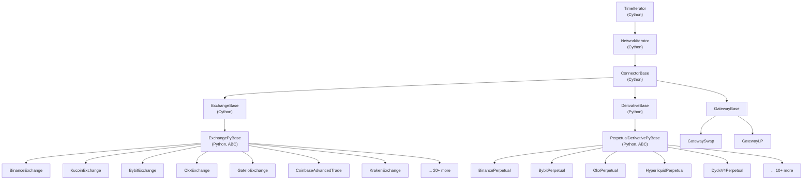
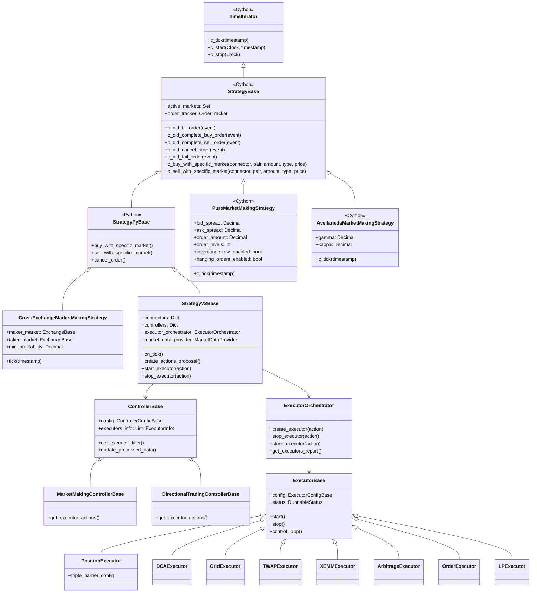

# Hummingbot Architecture

## System Architecture

Hummingbot follows a layered, event-driven architecture. The Clock drives time-based iteration across all components, while PubSub provides the event backbone for order and market data propagation.

## Trading Paradigm & Key Features

| Feature | Support | Details |
|---------|---------|---------|
| Backtesting Approach | Event-driven | Clock-based backtest mode with simulated time progression |
| Live Trading | Yes | Real-time trading on 28+ CEX spot, 15+ perpetual futures, and DEX via Gateway |
| Paper Trading | Yes | `PaperTrade` connector wraps any exchange with simulated execution |
| Multi-Asset | Yes | Crypto spot, perpetual futures, DEX tokens, liquidity pools |
| Data Feeds | Multiple | Exchange WebSocket/REST, CoinGecko, CoinCap, custom API, candles feed, liquidations feed |
| ML Integration | No | No built-in ML pipeline; strategies can integrate external models manually |
| Risk Management | Built-in | Kill switch (PnL threshold), inventory skew, budget checker, balance limits |
| Optimization | No | No built-in hyperparameter optimization; manual parameter tuning |
| Execution | Both | Simulated via paper trade; live on CEX (REST/WS) and DEX (Gateway) |

## Core Components

### HummingbotApplication

**Location**: `src/hummingbot/client/hummingbot_application.py`

The main application singleton that ties everything together. It inherits from all command mixins (using `*commands` unpacking) to compose the CLI interface. It can run in normal mode (with CLI) or headless mode (for programmatic/MQTT control).

Key responsibilities:
- CLI initialization (parser, completer, key bindings)
- Delegates trading to `TradingCore`
- MQTT bridge management
- Application warnings and logging

### TradingCore

**Location**: `src/hummingbot/core/trading_core.py`

The engine that manages the trading lifecycle independently of the UI. This separation allows headless operation and programmatic trading.

Key responsibilities:
- Clock creation and management (REALTIME/BACKTEST modes)
- Connector lifecycle via `ConnectorManager`
- Strategy loading, starting, and stopping
- Markets recorder and trade database
- Kill switch monitoring
- Gateway monitor integration

### Clock

**Location**: `src/hummingbot/core/clock.pyx`

A Cython-optimized clock that drives the entire system. It maintains a list of `TimeIterator` children and ticks them at configurable intervals. Supports two modes:

- **REALTIME**: Uses wall-clock time, tick size configurable (default 1.0s)
- **BACKTEST**: Simulates time progression from `start_time` to `end_time`

The clock is used as a context manager -- on exit, it stops all child iterators.

### PubSub Event System

**Location**: `src/hummingbot/core/pubsub.pyx`

Cython-optimized publish/subscribe system with weak references to avoid the lapsed listener problem. Dead listeners are garbage-collected probabilistically on `add_listener()` (0.5% chance) and deterministically on `remove_listener()`, `get_listeners()`, and `trigger_event()`.

Events are identified by integer tags (from `MarketEvent`, `AccountEvent`, `OrderBookEvent` enums). The `ConnectorBase` registers event reporters and loggers for all market events automatically.

### ConnectorManager

**Location**: `src/hummingbot/core/connector_manager.py`

Dynamically creates and manages exchange connectors. Supports:
- Creating connectors from connector settings
- Paper trade wrapping
- API key injection
- Hot-adding/removing connectors at runtime

### Rate Oracle

**Location**: `src/hummingbot/core/rate_oracle/rate_oracle.py`

Provides cross-exchange token conversion rates. Supports 15+ rate sources:

| Source | Class |
|--------|-------|
| Binance | `BinanceRateSource` |
| CoinGecko | `CoinGeckoRateSource` |
| CoinCap | `CoinCapRateSource` |
| KuCoin | `KucoinRateSource` |
| Gate.io | `GateIoRateSource` |
| Coinbase | `CoinbaseAdvancedTradeRateSource` |
| Hyperliquid | `HyperliquidRateSource` |
| OKX, Bybit, MEXC, etc. | Various |

The oracle fetches prices periodically and uses `find_rate()` to compute conversion rates between any two tokens by traversing available pairs.

### Command Interface

**Location**: `src/hummingbot/client/command/`

CLI commands are implemented as mixin classes that the `HummingbotApplication` inherits from:

| Command | File | Description |
|---------|------|-------------|
| `start` | `start_command.py` | Start a strategy |
| `stop` | `stop_command.py` | Stop the running strategy |
| `config` | `config_command.py` | View/edit configuration |
| `connect` | `connect_command.py` | Connect to an exchange |
| `balance` | `balance_command.py` | Check balances |
| `history` | `history_command.py` | Trade history |
| `order_book` | `order_book_command.py` | View order book |
| `ticker` | `ticker_command.py` | Price ticker |
| `gateway` | `gateway_command.py` | Gateway DEX management |
| `mqtt` | `mqtt_command.py` | MQTT bridge control |

### Data Feeds

**Location**: `src/hummingbot/data_feed/`

External data sources for strategies:

| Feed | Description |
|------|-------------|
| `CandlesFeed` | OHLCV candle data from exchanges |
| `CoinCapDataFeed` | CoinCap API price data |
| `CoinGeckoDataFeed` | CoinGecko API price data |
| `CustomApiDataFeed` | User-defined API endpoints |
| `MarketDataProvider` | Unified provider for V2 strategies (candles, rates, order books) |
| `LiquidationsFeed` | Liquidation event data |

---

## Connector Architecture

All connectors inherit from a Cython base class hierarchy optimized for performance:

### Connector Base Class Hierarchy

| Class | Language | Purpose |
|-------|----------|---------|
| `TimeIterator` | Cython | Clock-driven iteration with `c_tick()` |
| `NetworkIterator` | Cython | Network connectivity management |
| `ConnectorBase` | Cython | Balance tracking, event registration, trade fees, in-flight orders |
| `ExchangeBase` | Cython | Order books, budget checker, trading pair symbol mapping |
| `ExchangePyBase` | Python | Modern connector template with REST/WS assistants, throttling, polling |
| `DerivativeBase` | Python | Funding rates, position management, leverage |
| `PerpetualDerivativePyBase` | Python | Perpetual-specific base with position modes |

### ExchangePyBase Architecture

`ExchangePyBase` is the standard base for all modern CEX connectors. It provides:

- **WebAssistantsFactory**: Creates authenticated REST and WebSocket clients
- **OrderBookTracker**: Maintains real-time order books via WebSocket snapshots and diffs
- **UserStreamTracker**: Tracks user account updates (balances, orders, trades)
- **ClientOrderTracker**: Manages `InFlightOrder` state machine transitions
- **AsyncThrottler**: Rate limiting with per-endpoint controls
- **TimeSynchronizer**: Clock synchronization with exchange servers

Each concrete connector implements abstract methods for exchange-specific API details (endpoints, authentication, parsing).

### Gateway Integration

Gateway connectors communicate with the Hummingbot Gateway server (a separate Node.js service) for DEX interactions:

- **GatewayHttpClient**: REST client for Gateway API with SSL, health monitoring, chain/connector discovery
- **GatewaySwap**: Token swaps on DEXs (Uniswap, Jupiter, etc.)
- **GatewayLP**: Liquidity pool management (add/remove liquidity, range positions)

### Supported Exchange Connectors

**Spot (CEX)**: Ascend EX, Backpack, Binance, BingX, Bitget, Bitmart, Bitrue, Bitstamp, BTC Markets, Bybit, Coinbase Advanced Trade, Cube, Derive, Dexalot, Foxbit, Gate.io, HTX, Hyperliquid, Injective V2, Kraken, KuCoin, MEXC, NDAX, OKX, Vertex, XRPL

**Perpetual Futures**: Aevo, Backpack, Binance, Bitget, Bitmart, Bybit, Derive, dYdX V4, Gate.io, Hyperliquid, Injective V2, KuCoin, OKX, Pacifica

---

## Strategy Hierarchy

### V1 Strategies (Legacy)

Built directly on `StrategyBase` (Cython) with hardcoded tick logic:

| Strategy | Base | Description |
|----------|------|-------------|
| Pure Market Making | `StrategyBase` (Cython) | Single-exchange bid/ask quoting with spreads, levels, skew |
| Cross-Exchange MM | `StrategyPyBase` | Maker on one exchange, taker hedge on another |
| Avellaneda MM | `StrategyBase` (Cython) | Academic optimal market making model |
| AMM Arbitrage | `StrategyPyBase` | Arbitrage between AMM (DEX) and CEX |
| Spot-Perpetual Arb | `StrategyPyBase` | Spot vs perpetual futures arbitrage |
| Liquidity Mining | `StrategyPyBase` | Multi-pair liquidity provision |
| Hedge | `StrategyPyBase` | Hedging positions across venues |
| Perpetual MM | `StrategyBase` (Cython) | Market making on perpetual futures |

### V2 Strategy Framework

The V2 framework separates concerns into three layers:

1. **StrategyV2Base**: The strategy shell that manages controllers and the executor orchestrator
2. **Controllers**: Signal generation and executor action proposals (market making, directional trading)
3. **Executors**: Atomic order execution units with their own lifecycle

**Executor types**:

| Executor | Description |
|----------|-------------|
| `PositionExecutor` | Triple barrier position management (take profit, stop loss, trailing) |
| `DCAExecutor` | Dollar-cost averaging with configurable intervals |
| `GridExecutor` | Grid trading with configurable price levels |
| `TWAPExecutor` | Time-weighted average price execution |
| `XEMMExecutor` | Cross-exchange market making execution |
| `ArbitrageExecutor` | Cross-exchange arbitrage execution |
| `OrderExecutor` | Simple order execution with limit chasing |
| `LPExecutor` | DEX liquidity pool position management |

---
## See Also
- [README](README.md) — Project overview and quick start
- [Workflow](workflow.md) — Event flows and processing pipelines
- [State Management](state-management.md) — State lifecycle and data models
- [Development](development.md) — Development guide and best practices
