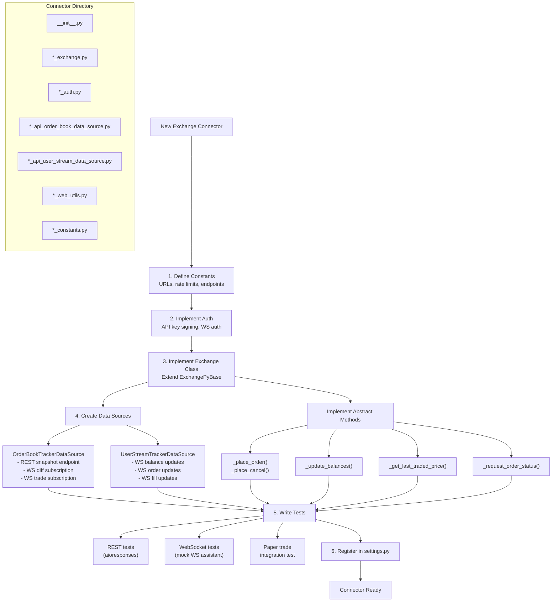

# Hummingbot Development Guide

## Development Setup

### Prerequisites

- Python 3.12 (exact match required)
- A C/C++ compiler (for Cython extensions)
- Git

### Installation

```bash
# Clone and checkout
git clone https://github.com/hummingbot/hummingbot.git
cd hummingbot
git checkout feature/ayu_develop

# Install with uv (recommended)
uv sync --active --all-groups --all-extras

# Or install with pip
pip install -e ".[all]"

# Build Cython extensions
python setup.py build_ext --inplace
```

### Running

```bash
# Interactive CLI mode
python -m hummingbot

# Headless mode (for programmatic/MQTT control)
python -m hummingbot --headless
```

### Running Tests

```bash
# All tests
pytest test/

# Specific connector tests
pytest test/hummingbot/connector/exchange/binance/

# Specific strategy tests
pytest test/hummingbot/strategy/pure_market_making/

# With coverage
pytest --cov=hummingbot test/
```

## Project Structure

```
hummingbot/
├── src/hummingbot/
│   ├── client/                    # CLI and application layer
│   │   ├── hummingbot_application.py  # Main application singleton
│   │   ├── command/               # CLI command implementations
│   │   │   ├── start_command.py
│   │   │   ├── stop_command.py
│   │   │   ├── config_command.py
│   │   │   ├── connect_command.py
│   │   │   ├── balance_command.py
│   │   │   ├── gateway_command.py
│   │   │   └── ...
│   │   ├── config/                # Configuration system
│   │   │   ├── client_config_map.py   # Main config model
│   │   │   ├── config_helpers.py      # Config loading utilities
│   │   │   ├── security.py            # API key encryption
│   │   │   └── ...
│   │   ├── settings.py            # Global settings and connector registry
│   │   ├── performance.py         # PnL calculation
│   │   └── ui/                    # CLI UI components
│   │       ├── hummingbot_cli.py  # prompt_toolkit CLI
│   │       ├── completer.py       # Tab completion
│   │       └── parser.py          # Command parser
│   │
│   ├── connector/                 # Exchange connectors
│   │   ├── connector_base.pyx     # Cython base (balances, events, fees)
│   │   ├── exchange_base.pyx      # Cython exchange base (order books)
│   │   ├── exchange_py_base.py    # Python exchange base (modern connectors)
│   │   ├── derivative_base.py     # Derivative connector base
│   │   ├── perpetual_derivative_py_base.py
│   │   ├── client_order_tracker.py    # InFlightOrder management
│   │   ├── budget_checker.py      # Balance/budget validation
│   │   ├── markets_recorder.py    # Trade persistence
│   │   ├── exchange/              # CEX connector implementations
│   │   │   ├── binance/
│   │   │   ├── bybit/
│   │   │   ├── kucoin/
│   │   │   ├── okx/
│   │   │   ├── gate_io/
│   │   │   ├── paper_trade/
│   │   │   └── ...  (28+ exchanges)
│   │   ├── derivative/            # Perpetual futures connectors
│   │   │   ├── binance_perpetual/
│   │   │   ├── bybit_perpetual/
│   │   │   ├── hyperliquid_perpetual/
│   │   │   └── ...  (15+ exchanges)
│   │   ├── gateway/               # DEX gateway connectors
│   │   │   ├── gateway_base.py
│   │   │   ├── gateway_swap.py
│   │   │   └── gateway_lp.py
│   │   └── utilities/             # Shared connector utilities
│   │
│   ├── core/                      # Core infrastructure
│   │   ├── clock.pyx              # Cython clock (REALTIME/BACKTEST)
│   │   ├── pubsub.pyx             # Cython event pub/sub
│   │   ├── time_iterator.pyx      # Clock-driven base class
│   │   ├── network_iterator.pyx   # Network connectivity base
│   │   ├── trading_core.py        # Core trading engine
│   │   ├── connector_manager.py   # Dynamic connector management
│   │   ├── data_type/             # Core data types
│   │   │   ├── in_flight_order.py # Order state machine
│   │   │   ├── order_book.py      # Order book data structure
│   │   │   ├── order_book_tracker.py
│   │   │   ├── user_stream_tracker.py
│   │   │   ├── common.py          # OrderType, TradeType, PriceType enums
│   │   │   ├── trade_fee.py       # Fee models
│   │   │   └── ...
│   │   ├── event/                 # Event system
│   │   │   ├── events.py          # Event enums and data classes
│   │   │   ├── event_listener.pyx
│   │   │   ├── event_forwarder.py
│   │   │   └── event_logger.py
│   │   ├── rate_oracle/           # Price conversion oracle
│   │   │   ├── rate_oracle.py
│   │   │   └── sources/           # 15+ rate sources
│   │   ├── gateway/               # Gateway HTTP client
│   │   ├── api_throttler/         # Rate limiting
│   │   ├── web_assistant/         # REST/WS client framework
│   │   │   ├── web_assistants_factory.py
│   │   │   ├── rest_assistant.py
│   │   │   ├── ws_assistant.py
│   │   │   └── auth.py
│   │   └── utils/                 # Utilities
│   │
│   ├── strategy/                  # V1 strategies
│   │   ├── strategy_base.pyx      # Cython strategy base
│   │   ├── strategy_py_base.pyx   # Python strategy base
│   │   ├── strategy_v2_base.py    # V2 strategy base
│   │   ├── pure_market_making/    # PMM strategy
│   │   ├── cross_exchange_market_making/  # XEMM strategy
│   │   ├── avellaneda_market_making/      # Avellaneda MM
│   │   ├── amm_arb/               # AMM arbitrage
│   │   ├── spot_perpetual_arbitrage/
│   │   ├── liquidity_mining/
│   │   ├── perpetual_market_making/
│   │   ├── hedge/
│   │   ├── order_tracker.pyx      # Strategy order tracking
│   │   └── hanging_orders_tracker.py
│   │
│   ├── strategy_v2/               # V2 strategy framework
│   │   ├── runnable_base.py       # Base for async components
│   │   ├── controllers/           # Signal generation
│   │   │   ├── controller_base.py
│   │   │   ├── market_making_controller_base.py
│   │   │   └── directional_trading_controller_base.py
│   │   ├── executors/             # Order execution
│   │   │   ├── executor_base.py
│   │   │   ├── executor_orchestrator.py
│   │   │   ├── position_executor/
│   │   │   ├── dca_executor/
│   │   │   ├── grid_executor/
│   │   │   ├── twap_executor/
│   │   │   ├── xemm_executor/
│   │   │   ├── arbitrage_executor/
│   │   │   ├── order_executor/
│   │   │   └── lp_executor/
│   │   ├── models/                # Data models
│   │   │   ├── base.py            # RunnableStatus enum
│   │   │   ├── executors.py       # CloseType enum
│   │   │   ├── executors_info.py  # ExecutorInfo, PerformanceReport
│   │   │   └── executor_actions.py
│   │   ├── backtesting/           # V2 backtesting support
│   │   └── utils/
│   │
│   ├── data_feed/                 # External data feeds
│   │   ├── data_feed_base.py
│   │   ├── market_data_provider.py
│   │   ├── candles_feed/          # OHLCV candle data
│   │   ├── coin_cap_data_feed/
│   │   ├── coin_gecko_data_feed/
│   │   └── liquidations_feed/
│   │
│   ├── model/                     # SQLAlchemy ORM models
│   │   ├── trade_fill.py
│   │   ├── order.py
│   │   ├── order_status.py
│   │   ├── position.py
│   │   ├── market_state.py
│   │   └── sql_connection_manager.py
│   │
│   ├── remote_iface/              # Remote control
│   │   └── mqtt.py                # MQTT bridge
│   │
│   ├── logger/                    # Logging system
│   ├── notifier/                  # Notification system
│   ├── templates/                 # Strategy config templates (YAML)
│   └── user/                      # User data management
│
├── test/                          # Test suite
│   └── hummingbot/
│       ├── connector/
│       ├── strategy/
│       ├── core/
│       └── ...
│
├── conf/                          # User configuration files
├── scripts/                       # User strategy scripts (V2)
├── docs/                          # Documentation
├── pyproject.toml                 # Project metadata and dependencies
└── setup.py                       # Cython build configuration
```

## Creating Custom Strategies

### V2 Strategy (Recommended)

The V2 framework is the recommended approach for new strategies. Create a script in the `scripts/` directory.

#### 1. Define the Configuration

```python
# scripts/my_strategy_config.py (or inline in the script)
from decimal import Decimal
from hummingbot.strategy.strategy_v2_base import StrategyV2ConfigBase

class MyStrategyConfig(StrategyV2ConfigBase):
    script_file_name: str = "my_strategy.py"

    # Strategy parameters
    exchange: str = "binance"
    trading_pair: str = "BTC-USDT"
    order_amount: Decimal = Decimal("0.001")
    spread: Decimal = Decimal("0.01")  # 1%

    def update_markets(self, markets: dict):
        """Define required markets."""
        markets[self.exchange] = {self.trading_pair}
```

#### 2. Create the Strategy Script

```python
# scripts/my_strategy.py
from decimal import Decimal
from typing import Dict, List
from hummingbot.strategy.strategy_v2_base import StrategyV2Base
from hummingbot.strategy_v2.models.executor_actions import (
    CreateExecutorAction, ExecutorAction
)
from hummingbot.strategy_v2.executors.position_executor.data_types import (
    PositionExecutorConfig, TripleBarrierConfig
)
from hummingbot.core.data_type.common import OrderType, TradeType

class MyStrategy(StrategyV2Base):
    def create_actions_proposal(self) -> List[ExecutorAction]:
        actions = []
        mid_price = self.get_mid_price("binance", "BTC-USDT")
        if mid_price is None:
            return actions

        # Create a long position executor
        config = PositionExecutorConfig(
            connector_name="binance",
            trading_pair="BTC-USDT",
            side=TradeType.BUY,
            amount=Decimal("0.001"),
            entry_price=mid_price * Decimal("0.999"),
            triple_barrier_config=TripleBarrierConfig(
                take_profit=Decimal("0.02"),
                stop_loss=Decimal("0.01"),
                time_limit=3600,
            ),
        )
        actions.append(CreateExecutorAction(executor_config=config))
        return actions
```

#### 3. Optionally Create a Controller

For more complex strategies, create a controller that generates executor actions:

```python
# controllers/my_controller.py
from hummingbot.strategy_v2.controllers.market_making_controller_base import (
    MarketMakingControllerBase, MarketMakingControllerConfigBase
)

class MyControllerConfig(MarketMakingControllerConfigBase):
    controller_name: str = "my_controller"
    connector_name: str = "binance"
    trading_pair: str = "BTC-USDT"
    # ... additional config

class MyController(MarketMakingControllerBase):
    def __init__(self, config: MyControllerConfig, *args, **kwargs):
        super().__init__(config, *args, **kwargs)

    def update_processed_data(self):
        # Analyze market data and prepare signals
        pass

    def get_executor_actions(self):
        # Return list of CreateExecutorAction / StopExecutorAction
        pass
```

### V1 Strategy (Legacy)

V1 strategies inherit from `StrategyPyBase` and implement `tick()` directly:

```python
from hummingbot.strategy.strategy_py_base import StrategyPyBase
from hummingbot.strategy.market_trading_pair_tuple import MarketTradingPairTuple

class MyLegacyStrategy(StrategyPyBase):
    def __init__(self, market_info: MarketTradingPairTuple,
                 spread: Decimal, amount: Decimal):
        super().__init__()
        self._market_info = market_info
        self._spread = spread
        self._amount = amount
        self.add_markets([market_info.market])

    def tick(self, timestamp: float):
        if not self._market_info.market.ready:
            return

        mid_price = self._market_info.get_mid_price()
        bid_price = mid_price * (1 - self._spread)
        ask_price = mid_price * (1 + self._spread)

        # Place orders
        self.buy_with_specific_market(
            self._market_info, self._amount,
            order_type=OrderType.LIMIT, price=bid_price
        )
        self.sell_with_specific_market(
            self._market_info, self._amount,
            order_type=OrderType.LIMIT, price=ask_price
        )
```

## Creating Custom Connectors

### Connector File Structure

Each CEX connector lives in `src/hummingbot/connector/exchange/<exchange_name>/`:

```
<exchange_name>/
├── __init__.py
├── <exchange_name>_exchange.py        # Main connector class
├── <exchange_name>_api_order_book_data_source.py  # Order book data source
├── <exchange_name>_api_user_stream_data_source.py # User stream data source
├── <exchange_name>_auth.py            # Authentication
├── <exchange_name>_web_utils.py       # API endpoints, URL construction
├── <exchange_name>_constants.py       # Constants (rate limits, URLs)
└── <exchange_name>_order_book.py      # Custom OrderBook (if needed)
```

### Implementing a Connector

#### 1. Define Constants

```python
# my_exchange_constants.py
from hummingbot.core.api_throttler.data_types import RateLimit

BASE_URL = "https://api.myexchange.com"
WS_URL = "wss://ws.myexchange.com"

# Rate limits
RATE_LIMITS = [
    RateLimit(limit_id="GET_ORDER_BOOK", limit=10, time_interval=1),
    RateLimit(limit_id="CREATE_ORDER", limit=5, time_interval=1),
    RateLimit(limit_id="CANCEL_ORDER", limit=5, time_interval=1),
]
```

#### 2. Implement Authentication

```python
# my_exchange_auth.py
from hummingbot.core.web_assistant.auth import AuthBase
from hummingbot.core.web_assistant.connections.data_types import RESTRequest, WSRequest

class MyExchangeAuth(AuthBase):
    def __init__(self, api_key: str, secret_key: str):
        self._api_key = api_key
        self._secret_key = secret_key

    async def rest_authenticate(self, request: RESTRequest) -> RESTRequest:
        # Add authentication headers/params
        request.headers["X-API-KEY"] = self._api_key
        # Add signature...
        return request

    async def ws_authenticate(self, request: WSRequest) -> WSRequest:
        # Add WebSocket authentication
        return request
```

#### 3. Implement the Exchange Class

Extend `ExchangePyBase` and implement all abstract methods:

```python
# my_exchange_exchange.py
from hummingbot.connector.exchange_py_base import ExchangePyBase

class MyExchangeExchange(ExchangePyBase):
    @property
    def name(self) -> str:
        return "my_exchange"

    @property
    def authenticator(self) -> AuthBase:
        return MyExchangeAuth(self._api_key, self._secret_key)

    @property
    def rate_limits_rules(self) -> List[RateLimit]:
        return RATE_LIMITS

    # Implement abstract methods:
    # _create_order_book_data_source()
    # _create_user_stream_data_source()
    # _place_order()
    # _place_cancel()
    # _get_last_traded_price()
    # _update_balances()
    # _request_order_status()
    # _all_trade_updates_for_order()
    # ... and more
```

#### 4. Implement Data Sources

Create `OrderBookTrackerDataSource` and `UserStreamTrackerDataSource` subclasses that implement WebSocket subscription and REST snapshot methods for your exchange's API.

## Testing Patterns

### Connector Testing

Connector tests use aioresponses to mock HTTP calls and a mock WebSocket for stream testing:

```python
import asyncio
from unittest.mock import patch, AsyncMock
from aioresponses import aioresponses
from test.hummingbot.connector.exchange.my_exchange.my_exchange_exchange import MyExchangeExchange

class TestMyExchange:
    def setup_method(self):
        self.exchange = MyExchangeExchange(
            api_key="test", secret_key="test",
            trading_pairs=["BTC-USDT"]
        )

    @aioresponses()
    def test_place_order(self, mock_api):
        mock_api.post("https://api.myexchange.com/order",
                      payload={"orderId": "123"})
        result = asyncio.get_event_loop().run_until_complete(
            self.exchange._place_order(...)
        )
        assert result.exchange_order_id == "123"
```

### Strategy Testing

Strategy tests use paper trade connectors and a backtest clock:

```python
from hummingbot.core.clock import Clock, ClockMode
from hummingbot.connector.exchange.paper_trade import create_paper_trade_market

class TestMyStrategy:
    def setup_method(self):
        self.clock = Clock(ClockMode.BACKTEST, tick_size=1.0,
                          start_time=1000, end_time=2000)
        self.connector = create_paper_trade_market("binance", ["BTC-USDT"])
        self.connector.set_balance("USDT", Decimal("10000"))
        self.strategy = MyStrategy(...)
        self.clock.add_iterator(self.connector)
        self.clock.add_iterator(self.strategy)
```

### Isolated Async Test Support

The project provides `IsolatedAsyncioWrapperTestCase` for tests that need isolated event loops, preventing test pollution across async test methods.

## Configuration System

### Configuration Hierarchy

```
Client Config (client_config_map.py)
├── Instance ID, kill switch, rate oracle source
├── Paper trade settings (balances)
├── Gateway config (host, port, SSL)
├── MQTT bridge config
├── Logging config
├── Exchange rate conversion
└── Tick size
```

### Configuration Files

| File | Location | Purpose |
|------|----------|---------|
| `conf_client.yml` | `conf/` | Main client configuration |
| `conf_fee_overrides.yml` | `conf/` | Custom fee overrides per exchange |
| `*.yml` | `conf/strategies/` | Strategy-specific configuration |
| `*.yml` | `conf/connectors/` | Exchange API keys (encrypted) |

### Config Data Types

Configuration uses Pydantic models (`BaseClientModel`) with validation:

```python
from hummingbot.client.config.config_data_types import BaseClientModel

class MyConfig(BaseClientModel):
    exchange: str = "binance"
    trading_pair: str = "BTC-USDT"
    spread: Decimal = Decimal("0.01")

    @field_validator("spread")
    def validate_spread(cls, v):
        if v <= 0:
            raise ValueError("Spread must be positive")
        return v
```

### Security

API keys are encrypted at rest using `Security` (`src/hummingbot/client/config/security.py`). Keys are stored in encrypted YAML files under `conf/connectors/` and decrypted at runtime using a user-provided password.

### Strategy Templates

YAML templates in `src/hummingbot/templates/` provide default configurations:

| Template | Strategy |
|----------|----------|
| `conf_pure_market_making_strategy_TEMPLATE.yml` | Pure Market Making |
| `conf_perpetual_market_making_strategy_TEMPLATE.yml` | Perpetual Market Making |
| `conf_amm_arb_strategy_TEMPLATE.yml` | AMM Arbitrage |
| `conf_spot_perpetual_arbitrage_strategy_TEMPLATE.yml` | Spot-Perpetual Arbitrage |
| `conf_liquidity_mining_strategy_TEMPLATE.yml` | Liquidity Mining |
| `conf_fee_overrides_TEMPLATE.yml` | Fee override defaults |

## Connector Creation Flow

The following diagram shows the steps to create a new CEX connector and how the components fit together:



## Configuration Reference

Hummingbot uses a layered configuration system with Pydantic models. The main client config is at `conf/conf_client.yml`, exchange credentials in `conf/connectors/`, and strategy configs in `conf/strategies/`.

### Client Configuration (`conf/conf_client.yml`)

| Parameter | Type | Default | Description |
|-----------|------|---------|-------------|
| `instance_id` | `str` | (auto-generated) | Unique 40-char hex identifier for this bot instance |
| `kill_switch_mode.kill_switch_enabled` | `bool` | `false` | Enable automatic shutdown based on PnL |
| `kill_switch_mode.kill_switch_rate` | `Decimal` | `-100` | PnL threshold (%) to trigger shutdown |
| `rate_oracle_source` | `str` | `"binance"` | Source for cross-exchange price conversion (15+ options) |
| `tick_size` | `float` | `1.0` | Clock tick interval in seconds |
| `gateway_api_host` | `str` | `"localhost"` | Gateway middleware hostname |
| `gateway_api_port` | `str` | `"15888"` | Gateway middleware port |
| `gateway_use_ssl` | `bool` | `true` | Use SSL for Gateway connections |
| `mqtt_bridge.mqtt_host` | `str` | `"localhost"` | MQTT broker hostname |
| `mqtt_bridge.mqtt_port` | `int` | `1883` | MQTT broker port |
| `mqtt_bridge.mqtt_username` | `str` | `""` | MQTT broker username |
| `mqtt_bridge.mqtt_password` | `str` | `""` | MQTT broker password |
| `mqtt_bridge.mqtt_namespace` | `str` | `"hbot"` | MQTT topic namespace |
| `mqtt_bridge.mqtt_ssl` | `bool` | `false` | Use SSL for MQTT |
| `mqtt_bridge.mqtt_autostart` | `bool` | `false` | Auto-connect to MQTT on startup |
| `market_data_collection.market_data_collection_enabled` | `bool` | `false` | Enable order book data collection |
| `market_data_collection.market_data_collection_interval` | `int` | `60` | Collection interval in seconds |
| `market_data_collection.market_data_collection_depth` | `int` | `20` | Order book depth to collect |
| `tables_format` | `str` | `"psql"` | Table format for CLI output (any `tabulate` format) |

### Paper Trade Configuration

| Parameter | Type | Default | Description |
|-----------|------|---------|-------------|
| `paper_trade_exchanges` | `list[str]` | `["binance", "kucoin", "kraken", "gate_io"]` | Exchanges enabled for paper trading |
| `paper_trade_account_balance` | `dict[str, float]` | `{"BTC": 1, "USDT": 100000, "ETH": 20, ...}` | Starting balances for paper trade mode |

### Pure Market Making Strategy Config

| Parameter | Type | Default | Description |
|-----------|------|---------|-------------|
| `exchange` | `str` | (required) | Exchange connector name |
| `market` | `str` | (required) | Trading pair (e.g., `BTC-USDT`) |
| `bid_spread` | `Decimal` | (required) | Bid spread from mid price (1 = 1%) |
| `ask_spread` | `Decimal` | (required) | Ask spread from mid price (1 = 1%) |
| `order_amount` | `Decimal` | (required) | Order size in base asset |
| `order_refresh_time` | `float` | (required) | Seconds between order refresh cycles |
| `order_levels` | `int` | `1` | Number of order levels on each side |
| `order_level_spread` | `Decimal` | `0` | Spread between order levels |
| `order_level_amount` | `Decimal` | `0` | Size increment per level |
| `inventory_skew_enabled` | `bool` | `false` | Enable inventory-weighted order sizing |
| `inventory_target_base_pct` | `Decimal` | `50` | Target base asset percentage (0-100) |
| `hanging_orders_enabled` | `bool` | `false` | Keep filled-side orders active |
| `order_optimization_enabled` | `bool` | `false` | Optimize order placement using order book depth |
| `add_transaction_costs` | `bool` | `false` | Add exchange fees to order pricing |
| `price_source` | `str` | `"current_market"` | Price source: `current_market`, `external_market`, or `custom_api` |
| `price_type` | `str` | `"mid_price"` | Price type: `mid_price`, `last_price`, `best_bid`, `best_ask`, `inventory_cost` |

## Troubleshooting

### 1. `Cython extension build fails`

Ensure you have a C/C++ compiler installed and Python development headers:
```bash
# Ubuntu/Debian
sudo apt-get install -y build-essential python3-dev
# macOS
xcode-select --install
# Then rebuild
python setup.py build_ext --inplace
```

### 2. `ModuleNotFoundError: No module named 'hummingbot.core.clock'`

This means Cython extensions are not compiled. Run:
```bash
python setup.py build_ext --inplace
```

### 3. Paper trade connector shows zero balances

Paper trade balances are configured in `conf/conf_client.yml` under `paper_trade_account_balance`. Ensure the currency symbols match what the exchange connector expects (e.g., `USDT` not `USD`).

### 4. `ConnectionError` when connecting to an exchange

- Verify API keys are correct using the exchange's own web interface
- Check if the exchange requires IP whitelisting for API access
- Ensure no firewall or proxy is blocking outbound HTTPS connections
- Some exchanges (e.g., Binance) have regional restrictions

### 5. Orders not being placed / `BudgetChecker` rejecting orders

The `BudgetChecker` validates that sufficient balance exists before placing orders. Common causes:
- `order_amount` exceeds available balance
- Fee reserve is insufficient (add more quote currency balance)
- For paper trade, increase balances in config

### 6. Strategy exits immediately with `Clock tick error`

This typically means a connector failed to initialize. Check:
- Exchange API credentials are set via `connect <exchange>` command
- The trading pair format is correct (use `BTC-USDT` not `BTC/USDT` -- Hummingbot uses dashes)
- The exchange supports the requested trading pair

### 7. Gateway connection refused

- Ensure Gateway is running (`docker ps` or check the Gateway process)
- Verify `gateway_api_host` and `gateway_api_port` in `conf/conf_client.yml`
- Check that SSL certificates are generated (run `gateway generate-certs` in the Hummingbot CLI)
- Verify Gateway logs for startup errors

### 8. MQTT bridge not connecting

- Ensure an MQTT broker (e.g., Mosquitto) is running at the configured host/port
- Set `mqtt_autostart: true` in config to connect on startup
- Check broker authentication if `mqtt_username`/`mqtt_password` are set
- Verify firewall allows connections on the MQTT port (default 1883)

### 9. `asyncio` event loop errors or `RuntimeError: Event loop is closed`

Hummingbot relies heavily on asyncio. These errors often occur when:
- Running in an incompatible Jupyter environment
- Tests pollute the event loop (use `IsolatedAsyncioWrapperTestCase` for test isolation)
- Python version mismatch (requires exactly Python 3.12)

### 10. Exchange connector tests fail with `aioresponses` errors

Ensure `aioresponses` is installed and the mock URLs match the exchange's current API endpoints. Exchange APIs change frequently -- check if the connector constants file needs updating.

## Security Considerations

- **API key encryption**: Hummingbot encrypts exchange API keys at rest using AES encryption via the `Security` class (`src/hummingbot/client/config/security.py`). Keys are stored in encrypted YAML files under `conf/connectors/`. A user-provided password decrypts them at runtime. Use a strong, unique password.
- **Password management**: The encryption password is entered interactively at startup and held in memory. It is never written to disk. If you lose the password, you must re-enter API keys.
- **Gateway mTLS**: Gateway communication uses mutual TLS (client certificates). Certificates are generated locally and stored in `conf/certs/`. Protect this directory from unauthorized access.
- **Wallet private keys**: When using Gateway for DEX trading, wallet private keys are stored in encrypted keystores within the Gateway service. Never share Gateway data directories.
- **MQTT exposure**: If MQTT bridge is enabled, bot commands and trade events are transmitted over MQTT. Use `mqtt_ssl: true` and authentication in production. Never expose the MQTT broker to the public internet without authentication.
- **Paper trade isolation**: Paper trade connectors simulate order execution locally. Ensure you are not accidentally connected to a real exchange connector with real API keys when testing.
- **Database contents**: The SQLite database (`hummingbot_trades.sqlite`) stores complete trade history. Set file permissions appropriately and do not share database files.
- **Config file permissions**: Strategy configs and `conf_client.yml` may contain sensitive parameters. Restrict permissions: `chmod 600 conf/*.yml conf/connectors/*.yml`.
- **Docker deployment**: When running in Docker, use volume mounts for `conf/` and avoid baking credentials into images. Use Docker secrets or environment variables for sensitive values.
- **Rate limiting**: Each exchange connector implements rate limiting via `ApiThrottler`. Do not bypass or reduce rate limits, as this can result in IP bans from exchanges.

---
## See Also
- [README](README.md) — Project overview and quick start
- [Architecture](architecture.md) — System design and components
- [Workflow](workflow.md) — Event flows and processing pipelines
- [State Management](state-management.md) — State lifecycle and data models
