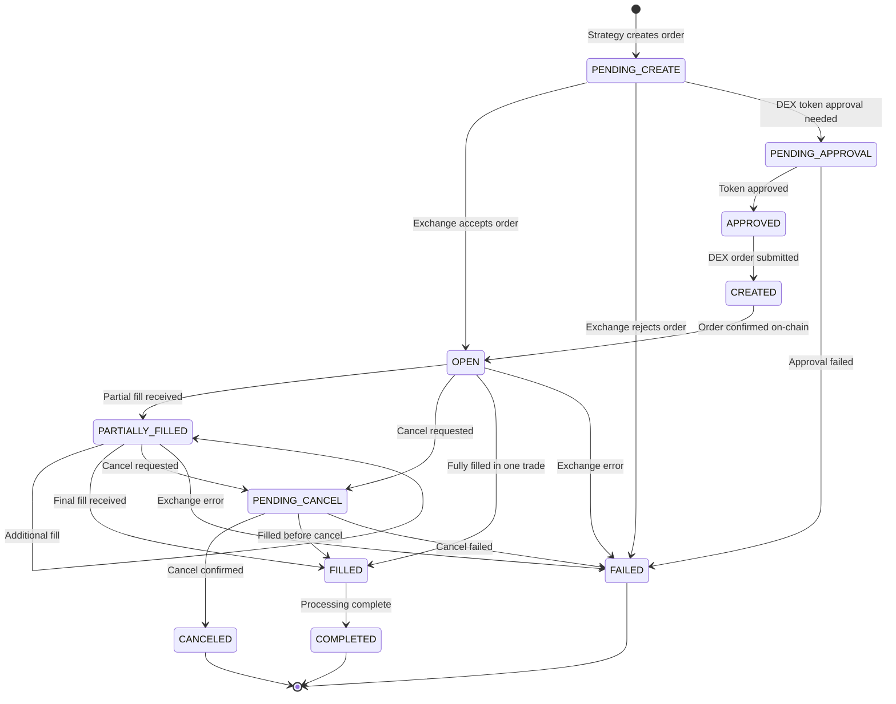
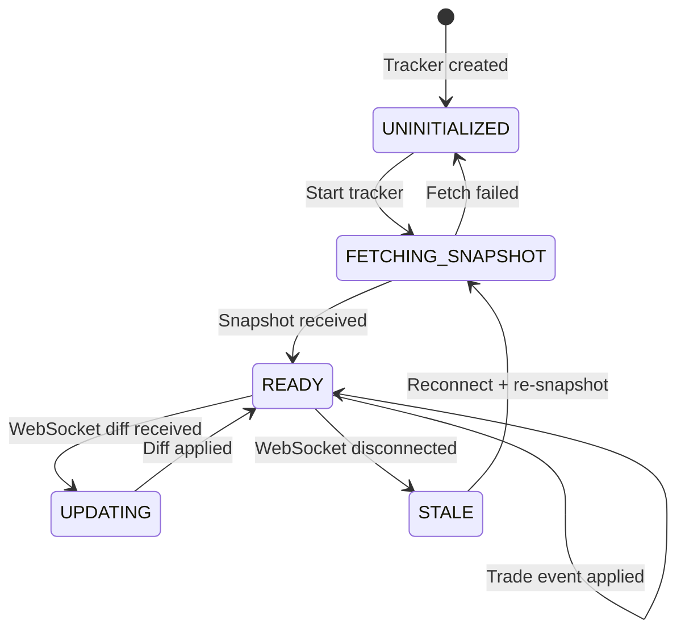
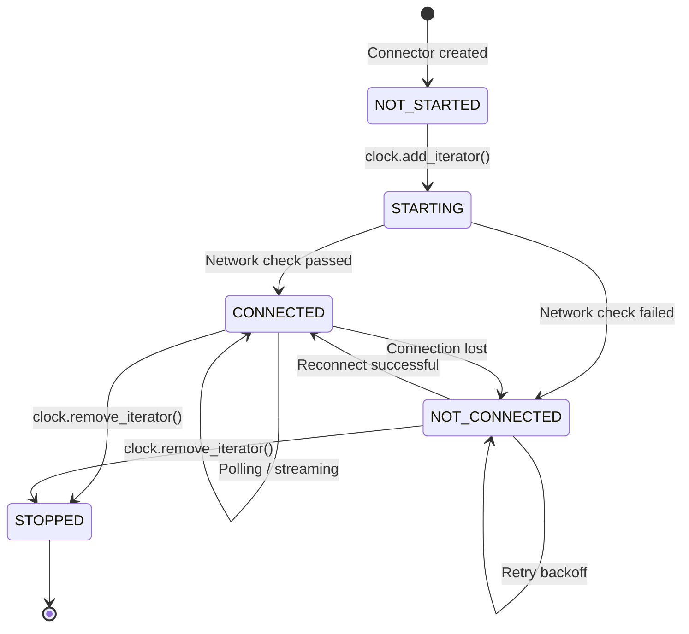
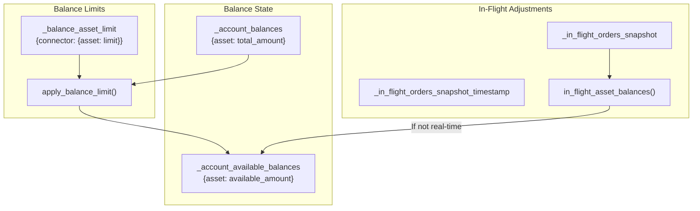
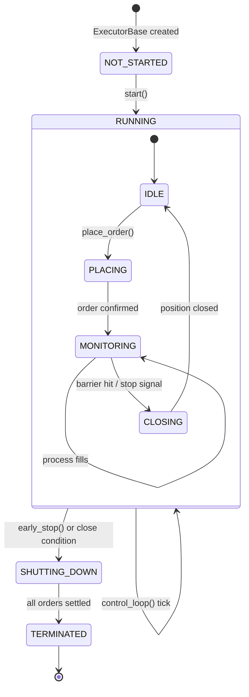

# Hummingbot State Management

## Order State Machine

Every order in Hummingbot is tracked as an `InFlightOrder` instance (`src/hummingbot/core/data_type/in_flight_order.py`). The `OrderState` enum defines all possible states:



### OrderState Values

| State | Code | Description |
|-------|------|-------------|
| `PENDING_CREATE` | 0 | Order request sent, awaiting exchange acknowledgment |
| `OPEN` | 1 | Order accepted and live on the exchange |
| `PENDING_CANCEL` | 2 | Cancel request sent, awaiting confirmation |
| `CANCELED` | 3 | Order successfully cancelled |
| `PARTIALLY_FILLED` | 4 | Some quantity executed, order still active |
| `FILLED` | 5 | Full quantity executed |
| `FAILED` | 6 | Order failed (rejected, network error, insufficient balance) |
| `PENDING_APPROVAL` | 7 | DEX: waiting for token spending approval |
| `APPROVED` | 8 | DEX: token approval granted |
| `CREATED` | 9 | DEX: order transaction submitted |
| `COMPLETED` | 10 | Terminal state after full processing |

### InFlightOrder Properties

The `InFlightOrder` class tracks:

- `client_order_id`: Hummingbot-generated unique ID
- `exchange_order_id`: Exchange-assigned ID (set asynchronously)
- `trading_pair`: e.g., "BTC-USDT"
- `order_type`: LIMIT, MARKET, LIMIT_MAKER
- `trade_type`: BUY or SELL
- `price`, `amount`: Order parameters
- `executed_amount_base`, `executed_amount_quote`: Filled quantities
- `order_fills`: Dict of `TradeUpdate` objects keyed by trade ID
- `leverage`, `position`: For derivative orders
- `exchange_order_id_update_event`: Async event for ID resolution
- `completely_filled_event`: Async event for fill completion

### ClientOrderTracker

The `ClientOrderTracker` (`src/hummingbot/connector/client_order_tracker.py`) manages all in-flight orders for a connector:

- Maintains active and cached order dictionaries
- Processes `OrderUpdate` messages to transition order states
- Processes `TradeUpdate` messages to record fills
- Emits PubSub events for each state transition
- Handles order expiry and lost order recovery

## Market State Tracking

### Order Book State

Each trading pair's order book is maintained by an `OrderBook` instance within the `OrderBookTracker`:



The order book state includes:
- **Bids**: Price-sorted descending list of `(price, amount)` rows
- **Asks**: Price-sorted ascending list of `(price, amount)` rows
- **Last diff timestamp**: For staleness detection
- **Snapshot timestamp**: When the last full snapshot was taken

### Trading Rules

Each exchange provides trading rules per trading pair, stored in `TradingRule` objects:

- `min_order_size`: Minimum order quantity
- `max_order_size`: Maximum order quantity
- `min_price_increment`: Price tick size
- `min_base_amount_increment`: Quantity step size
- `min_quote_amount_increment`: Quote amount step
- `min_notional_size`: Minimum order value
- `supports_limit_orders`, `supports_market_orders`: Order type support

## Connector State Lifecycle

Connectors inherit from `NetworkIterator` which provides network state management:



### NetworkStatus Values

| Status | Meaning |
|--------|---------|
| `STOPPED` | Not running |
| `NOT_STARTED` | Created but not started |
| `NOT_CONNECTED` | Started but cannot reach exchange |
| `CONNECTED` | Fully operational |

### Connector Runtime Tasks

When a connector is connected, it runs several async tasks:

| Task | Purpose | Poll Interval |
|------|---------|---------------|
| `_status_polling_task` | Balance + order status updates | 5s (short) / 120s (long) |
| `_user_stream_tracker_task` | WebSocket user data stream | Continuous |
| `_user_stream_event_listener_task` | Process user stream messages | Continuous |
| `_trading_rules_polling_task` | Refresh trading rules | 30 minutes |
| `_trading_fees_polling_task` | Refresh fee schedules | 12 hours |
| `_lost_orders_update_task` | Recover orphaned orders | Periodic |

## Position and Inventory Tracking

### Balance Tracking (ConnectorBase)



Two balance tracking modes:
- **Real-time** (`_real_time_balance_update = True`): Exchange provides real-time available balance updates via WebSocket. Most modern connectors use this mode.
- **Calculated** (`_real_time_balance_update = False`): Available balance is computed from the last snapshot minus in-flight order locks. Used when the exchange does not provide real-time available balance.

### Derivative Position Tracking

For perpetual futures connectors (`DerivativeBase` / `PerpetualDerivativePyBase`):

| Property | Type | Description |
|----------|------|-------------|
| `account_positions` | `Dict[str, Position]` | Current open positions |
| `position_mode` | `PositionMode` | ONE_WAY or HEDGE |
| `funding_info` | `Dict[str, FundingInfo]` | Current funding rates |
| `leverage` | `Dict[str, int]` | Per-pair leverage settings |

Position state is updated through:
- REST polling (periodic position queries)
- WebSocket user stream (real-time position updates)
- `AccountEvent.PositionUpdate` events

### Inventory Management in Strategies

**Pure Market Making** provides inventory skew to maintain target inventory ratios:

```
target_base_pct = 50%  (configurable)
current_base_pct = base_value / (base_value + quote_value)

If current_base_pct > target:
    Reduce bid sizes, increase ask sizes
If current_base_pct < target:
    Increase bid sizes, reduce ask sizes
```

The `InventoryCostPriceDelegate` tracks the average entry cost of inventory positions for PnL calculation.

## Strategy State Management

### V1 Strategy State

V1 strategies maintain state through:

| Component | Description |
|-----------|-------------|
| `OrderTracker` | Tracks active maker/taker orders with creation timestamps |
| `HangingOrdersTracker` | Manages orders that persist across refresh cycles |
| `MovingPriceBand` | Tracks rolling price bounds for order placement |
| `AssetPriceDelegate` | Price reference from external source or order book |
| Conditional execution state | Time/price conditions for strategy activation |

### V2 Strategy State

The V2 framework manages state through the `ExecutorOrchestrator`:



#### ExecutorOrchestrator State

The `ExecutorOrchestrator` (`src/hummingbot/strategy_v2/executors/executor_orchestrator.py`) manages:

- **Active executors**: Currently running executors grouped by controller ID
- **Position holds**: `PositionHold` objects tracking cumulative position state per connector/pair/side
- **Performance reports**: Aggregated `PerformanceReport` with PnL, volume, and trade counts
- **Executor actions queue**: Pending create/stop/store actions from controllers

#### PositionHold Tracking

For derivative trading, the orchestrator maintains `PositionHold` objects that track:

- `volume_traded_quote`: Total quote volume traded
- `cum_fees_quote`: Cumulative fees in quote currency
- `buy_amount_base` / `buy_amount_quote`: Long side tracking
- `sell_amount_base` / `sell_amount_quote`: Short side tracking
- `order_ids`: Set of client order IDs belonging to this position

### Database Persistence

Trade state is persisted to SQLite via the `MarketsRecorder` and SQLAlchemy models in `src/hummingbot/model/`:

| Model | Table | Data |
|-------|-------|------|
| `TradeFill` | `TradeFill` | Executed trade fills with fees, prices, amounts |
| `Order` | `Order` | Order records with status, timestamps |
| `OrderStatus` | `OrderStatus` | Order status history |
| `Position` | `Position` | Derivative positions |
| `MarketState` | `MarketState` | Connector state snapshots |
| `MarketData` | `MarketData` | Order book and market data snapshots |
| `FundingPayment` | `FundingPayment` | Perpetual funding payments |
| `InventoryCost` | `InventoryCost` | Inventory cost basis tracking |

### Kill Switch State

The `KillSwitch` monitors portfolio performance and triggers strategy shutdown:

- Tracks overall PnL against configured thresholds
- `kill_switch_rate`: PnL percentage threshold (e.g., -5.0 = stop at 5% loss)
- Evaluates on each clock tick
- Calls `TradingCore.stop_strategy()` when threshold is breached

---
## See Also
- [README](README.md) — Project overview and quick start
- [Architecture](architecture.md) — System design and components
- [Workflow](workflow.md) — Event flows and processing pipelines
- [Development](development.md) — Development guide and best practices
