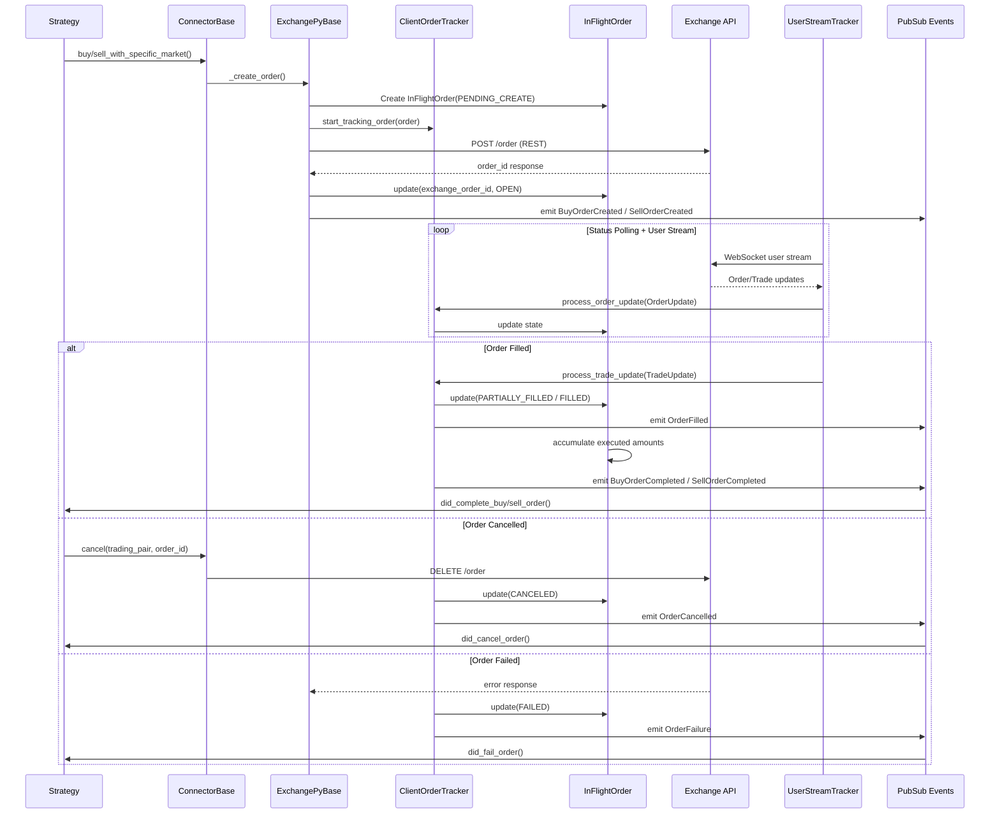
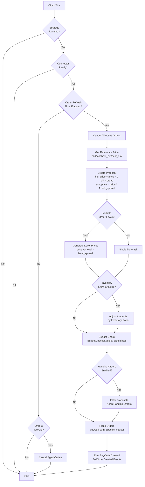
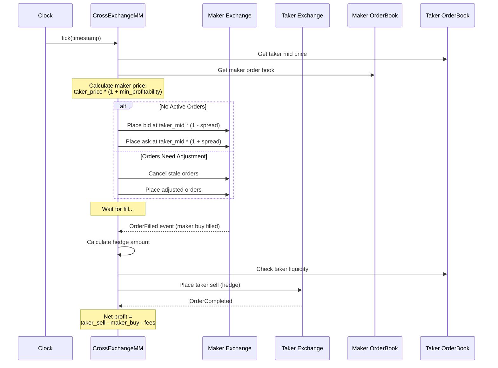
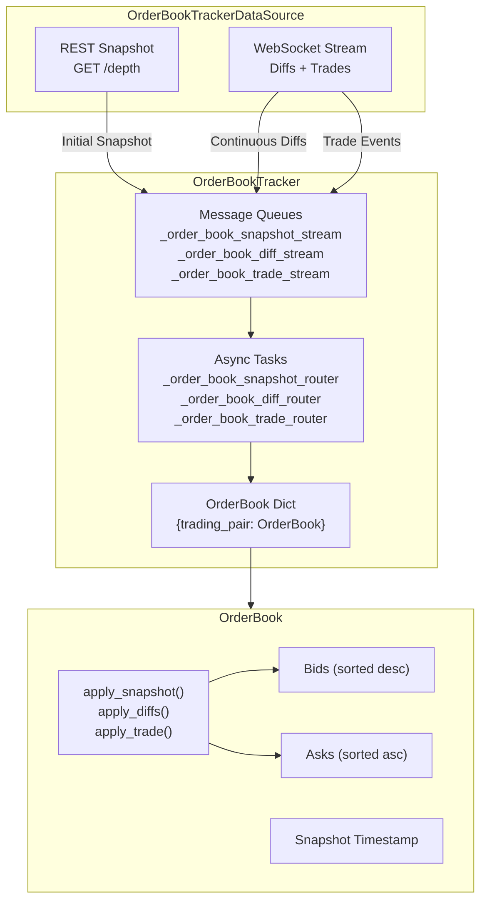
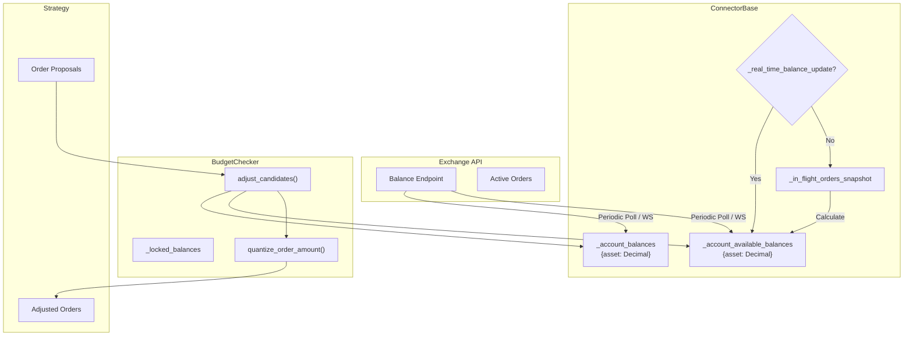
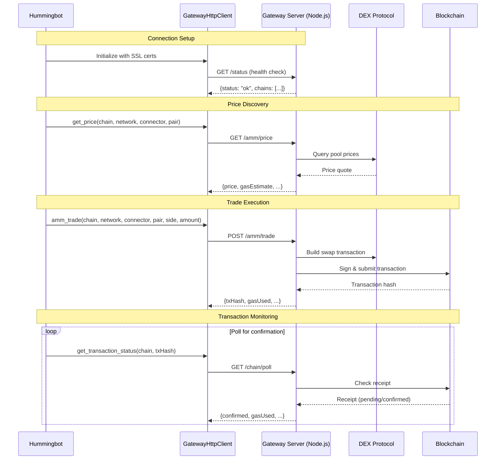
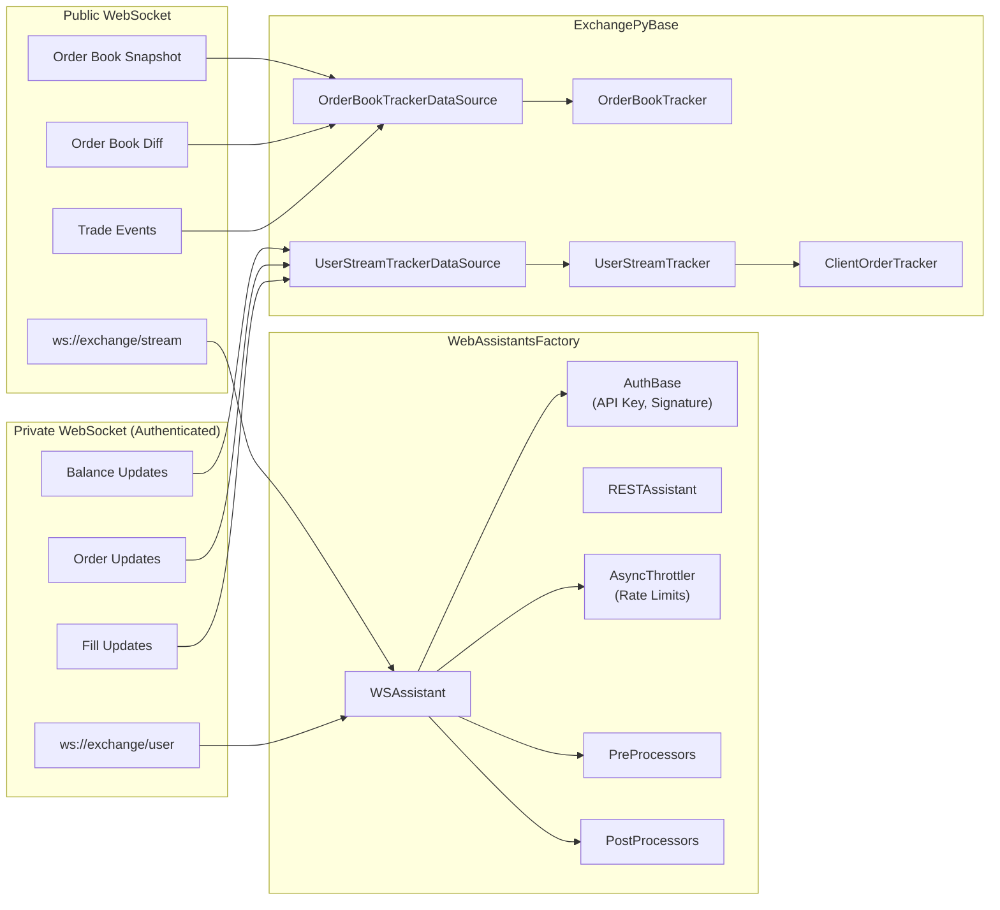
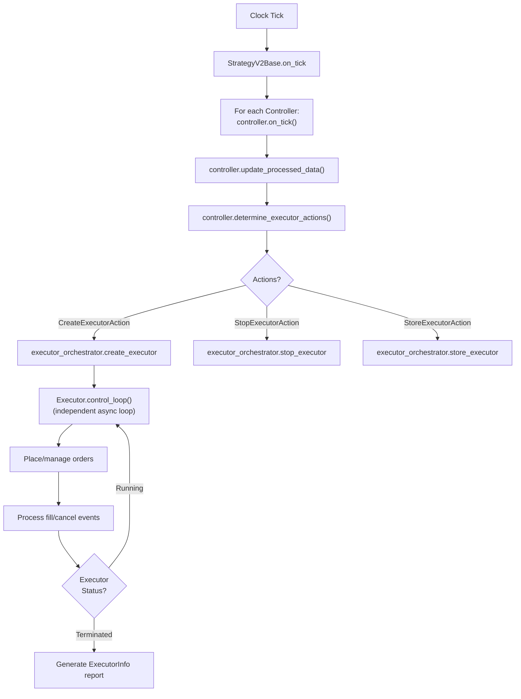

# Hummingbot Workflows

## Order Lifecycle

Every order in Hummingbot passes through the `InFlightOrder` state machine, tracked by the `ClientOrderTracker` within each connector. The lifecycle begins when a strategy requests an order and ends when the exchange confirms completion or failure.



## Market Making Order Placement (Pure Market Making)

The Pure Market Making strategy places bid and ask orders symmetrically around a reference price. On each tick, it evaluates whether existing orders need refreshing.



## Cross-Exchange Market Making (XEMM)

XEMM places maker orders on one exchange and immediately hedges fills with taker orders on another exchange. This captures the spread between venues.



## Order Book Tracking

Each connector maintains real-time order books through the `OrderBookTracker` and `OrderBookTrackerDataSource`.



## Balance and Inventory Management

The connector tracks two types of balances: total balances and available balances (accounting for in-flight orders).



## Gateway Integration Flow

For DEX trading, Hummingbot communicates with a separate Gateway server that handles blockchain interactions.



## WebSocket Data Streaming

Modern connectors use a dual-stream WebSocket architecture: one for public market data and one for private user data.



## Event System and Handlers

The event system is the backbone of communication between connectors and strategies. Events flow upward from connectors through the PubSub system to strategy event listeners.

### Market Events

Events defined in `src/hummingbot/core/event/events.py`:

| Event | Code | Trigger |
|-------|------|---------|
| `ReceivedAsset` | 101 | Asset deposit received |
| `BuyOrderCompleted` | 102 | Buy order fully filled |
| `SellOrderCompleted` | 103 | Sell order fully filled |
| `OrderCancelled` | 106 | Order cancelled |
| `OrderFilled` | 107 | Order partially or fully filled |
| `OrderExpired` | 108 | Order expired |
| `OrderUpdate` | 109 | Order state change |
| `TradeUpdate` | 110 | New trade fill |
| `OrderFailure` | 198 | Order placement failed |
| `TransactionFailure` | 199 | Transaction failed |
| `BuyOrderCreated` | 200 | Buy order submitted |
| `SellOrderCreated` | 201 | Sell order submitted |
| `FundingPaymentCompleted` | 202 | Perpetual funding payment |

### Account Events

| Event | Code | Trigger |
|-------|------|---------|
| `PositionModeChangeSucceeded` | 400 | Position mode changed |
| `PositionModeChangeFailed` | 401 | Position mode change failed |
| `BalanceEvent` | 402 | Balance update |
| `PositionUpdate` | 403 | Position change |
| `MarginCall` | 404 | Margin call warning |
| `LiquidationEvent` | 405 | Position liquidated |

### Strategy Event Listeners (V1)

The `StrategyBase` class registers Cython event listeners for each market event. When an event fires, the corresponding `c_did_*` method is called:

```
BuyOrderCompleted  -> c_did_complete_buy_order(event)
SellOrderCompleted -> c_did_complete_sell_order(event)
OrderFilled        -> c_did_fill_order(event)
OrderCancelled     -> c_did_cancel_order(event)
OrderExpired       -> c_did_expire_order(event)
OrderFailure       -> c_did_fail_order(event)
FundingPayment     -> c_did_complete_funding_payment(event)
```

### V2 Executor Event Forwarding

V2 executors use `SourceInfoEventForwarder` to route events to handler methods:

```
BuyOrderCreated    -> process_order_created_event()
SellOrderCreated   -> process_order_created_event()
OrderFilled        -> process_order_filled_event()
BuyOrderCompleted  -> process_order_completed_event()
SellOrderCompleted -> process_order_completed_event()
OrderCancelled     -> process_order_canceled_event()
OrderFailure       -> process_order_failed_event()
```

### V2 Strategy Tick Flow



---
## See Also
- [README](README.md) — Project overview and quick start
- [Architecture](architecture.md) — System design and components
- [State Management](state-management.md) — State lifecycle and data models
- [Development](development.md) — Development guide and best practices
